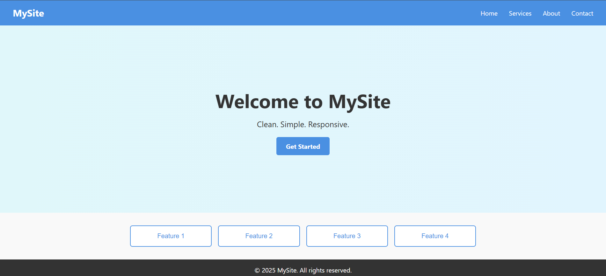

# Mail

_website design project_

## About

Self-directed project for learning purpose.

Site published at: https://aura-lem.github.io/my-site/

Design: 

## Project features/goals

  - Github pages
  - no responsive design
  - inline CSS
  - display: flex
  - favicon
  - hover state
  

## Getting Started

### Prerequisites

Node.js - _download and install_

```
https://nodejs.org
```

Git - _download and install_

```
https://git-scm.com
```

### Run locally

Would like to run this project locally? Open terminal and follow these steps:

1. Clone the repo
    ```sh
    git clone https://github.com/Aura-Lem/my-site.git
    ```
2. Install NPM packages
    ```sh
    npm i
    ```
    or
    ```sh
    npm install
    ```
3. Run the server
    ```sh
    npm run dev
    ```

### Running tests

There is no tests for this project.

## Authors 

Aurelija: [Github](https://github.com/Aura-Lem)